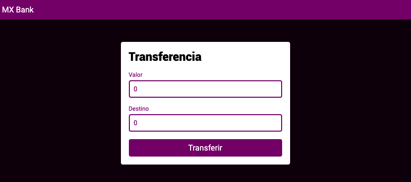
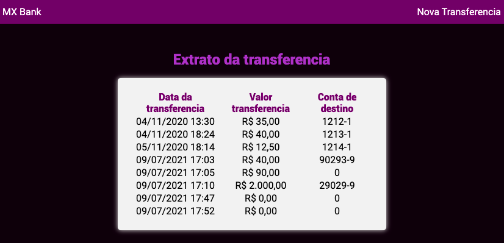

<h1 align="center">Welcome to MX Bank 👋</h1>
<p>
  
  <a href="https://twitter.com/maisamaximo\_" target="_blank">
  </a>
</p>

> Projeto desenvolvido em aula do curso 'Angular: Começando com o framework' da plataforma Alura. Trata-se de uma aplicação que realiza cadastro de transferencias e exibe o extrato simplificado.




## Install

```sh
npm install
```

## Usage

```sh
ng serve
```

## Load Data

```sh
json-server --watch db.json
```

## Author

👤 **Maisa Maximo Ferreira**

* Website: https://maisamaximo.com/\
* Twitter: [@maisamaximo\_](https://twitter.com/maisamaximo\_)
* Github: [@maisamaximo](https://github.com/maisamaximo)
* LinkedIn: [@maisa-maximo](https://linkedin.com/in/maisa-maximo)

***
_This README was generated with ❤️  by [readme-md-generator](https://github.com/kefranabg/readme-md-generator)_
